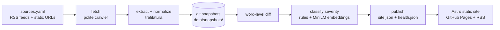

# MemoryHole 🕳️

**News gets edited after you read it — this machine notices.**

[](https://github.com/dipeshrayg/memoryhole/actions/workflows/daily.yml)
[](https://github.com/dipeshrayg/memoryhole/actions/workflows/ci.yml)

MemoryHole is a fully autonomous observatory for **silent edits**: changes made to
published news articles and official statements after publication, with no correction
notice. Every day it re-reads every tracked page, diffs the text against yesterday's
snapshot, classifies how much the meaning changed, and publishes the results as a
static site with side-by-side diffs and an RSS feed.

**Live site:** https://dipeshrayg.github.io/memoryhole/

It runs entirely on permanently free infrastructure — GitHub Actions + GitHub Pages.
No servers, no databases, no API keys.

## How it works



1. **fetch** — discovers articles from RSS feeds, re-checks each one daily for its
   tracking window, and snapshots the normalized article text into git. Git history
   *is* the archive.
2. **diff** — word-level diff against the previous snapshot, immune to HTML/boilerplate
   churn, producing rule-based signals: numbers changed, named entities swapped, quotes
   deleted, paragraphs added/removed, headline changes.
3. **classify** — signals are weighted together with semantic similarity from a local
   [all-MiniLM-L6-v2](https://huggingface.co/sentence-transformers/all-MiniLM-L6-v2)
   model into one of four severities:
   `COSMETIC` (typos, formatting) · `MINOR` (rewording, same meaning) ·
   `FACTUAL` (numbers/names/dates changed) · `NARRATIVE` (claims added/removed,
   meaning shifted). Optionally, if the `LLM_API_KEY` secret is set (e.g. a free-tier
   Groq key), an LLM adjudicates borderline FACTUAL-vs-NARRATIVE calls.
4. **publish** — writes `data/derived/site.json`, from which the Astro site builds the
   daily feed, side-by-side diff pages, per-source statistics, and `rss.xml`.

## Add or change sources

Edit [`sources.yaml`](sources.yaml) — no code changes needed:

```yaml
sources:
  - name: My Outlet          # RSS: newest articles are auto-discovered and tracked
    rss: https://example.com/feed.xml
    max_articles: 5          # optional, newest entries to adopt per run
  - name: Some Ministry      # static page: tracked forever
    url: https://example.gov/statements
```

## Run your own instance in 5 minutes

1. **Fork** this repo (public fork keeps everything free).
2. In your fork: **Settings → Pages → Source: GitHub Actions**.
3. **Actions tab → enable workflows**, then run **daily** via *Run workflow*.
4. Done. First run takes baseline snapshots; edits appear from the second run on.
   Your site is at `https://<you>.github.io/<repo>/`.
5. (Optional) Edit `sources.yaml`; add an `LLM_API_KEY` repo secret for LLM
   adjudication of borderline cases.

Run locally:

```bash
pip install -e "pipeline[ml,dev]"
memoryhole run-all          # fetch, diff, classify, publish (see --help)
pytest pipeline             # tests
cd site && npm ci && npm run dev
```

## Ethics

- Respects `robots.txt`; identifies honestly as `MemoryHoleBot/1.0 (+repo url)`.
- At most one request per two seconds per domain (configurable per source).
- Never fetches paywalled content; stores only extracted article text needed for
  diffing, always with attribution and a link to the original.
- A FACTUAL/NARRATIVE badge means "worth a human look", not an accusation. Outlets
  legitimately update developing stories; the point is that the record of change
  should be public.

## Free-tier budget

A daily run is ~10–20 minutes of Actions time (fetches dominate; the model is cached),
≈ 300–600 minutes/month against the 2,000-minute free allowance for private repos —
and **public repos are unlimited**. Pages, storage, and bandwidth stay comfortably
inside free limits.

## License

MIT — see [LICENSE](LICENSE).
